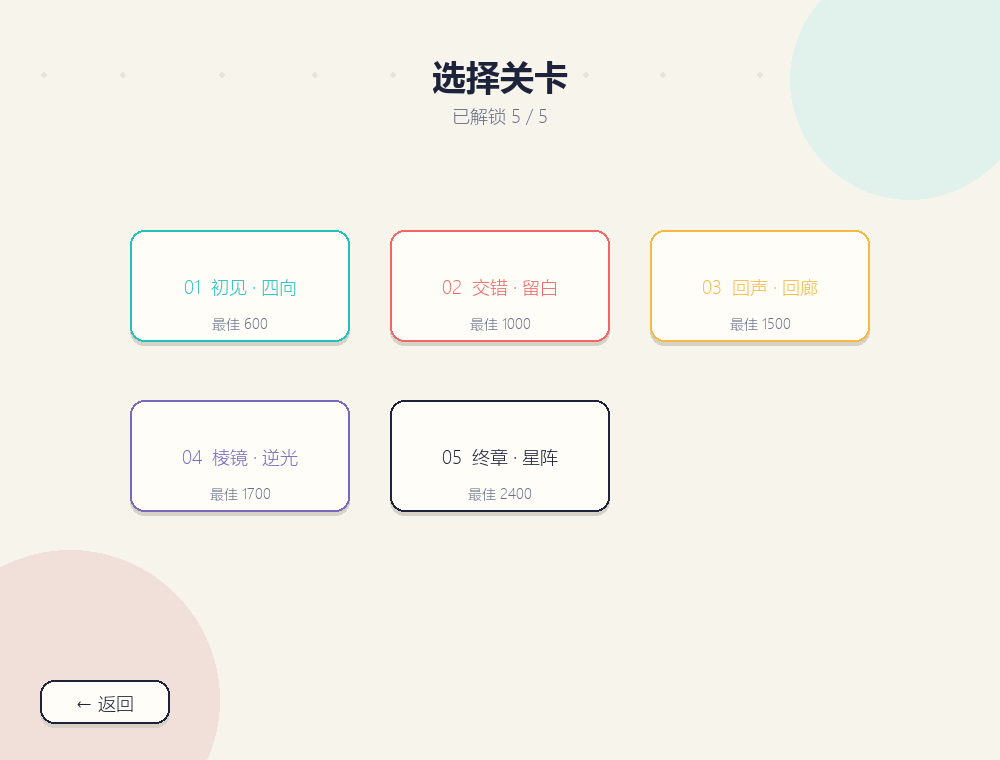
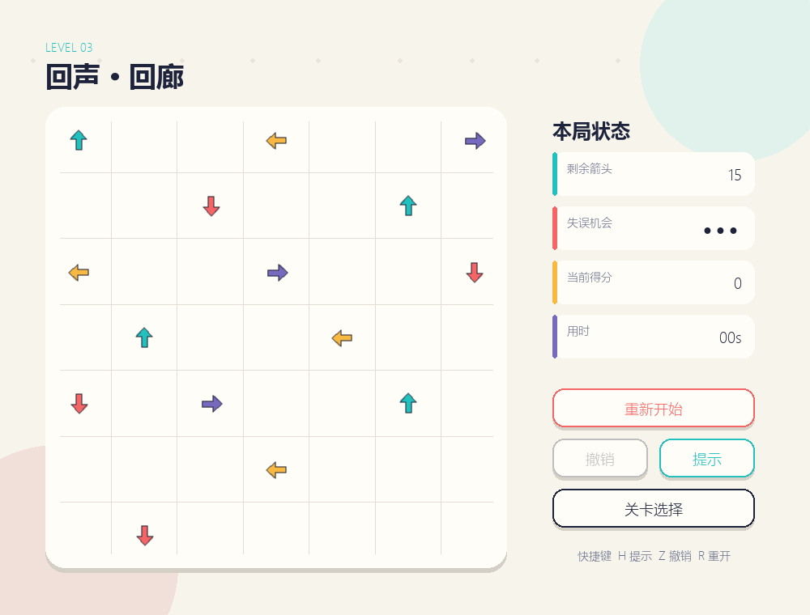
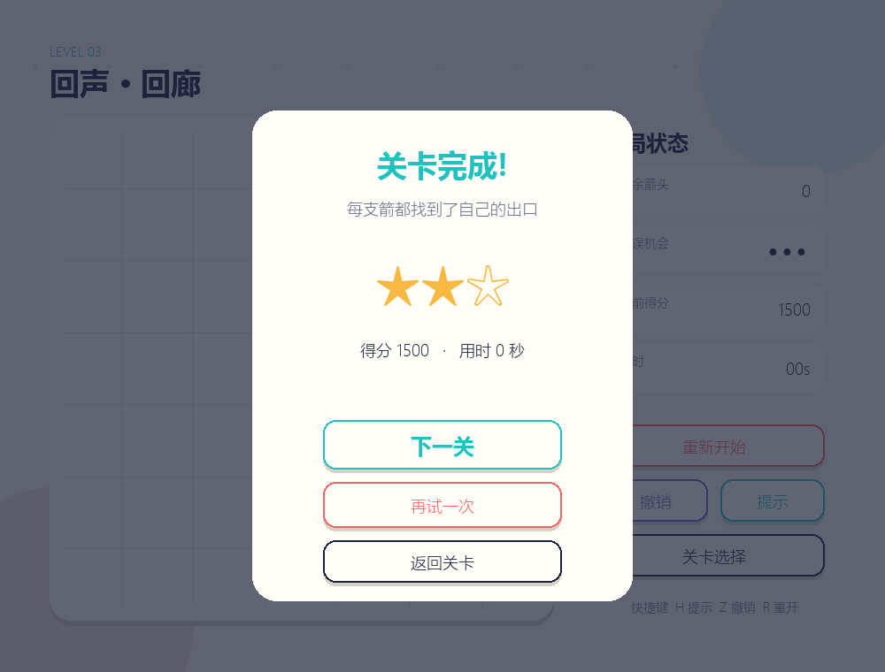
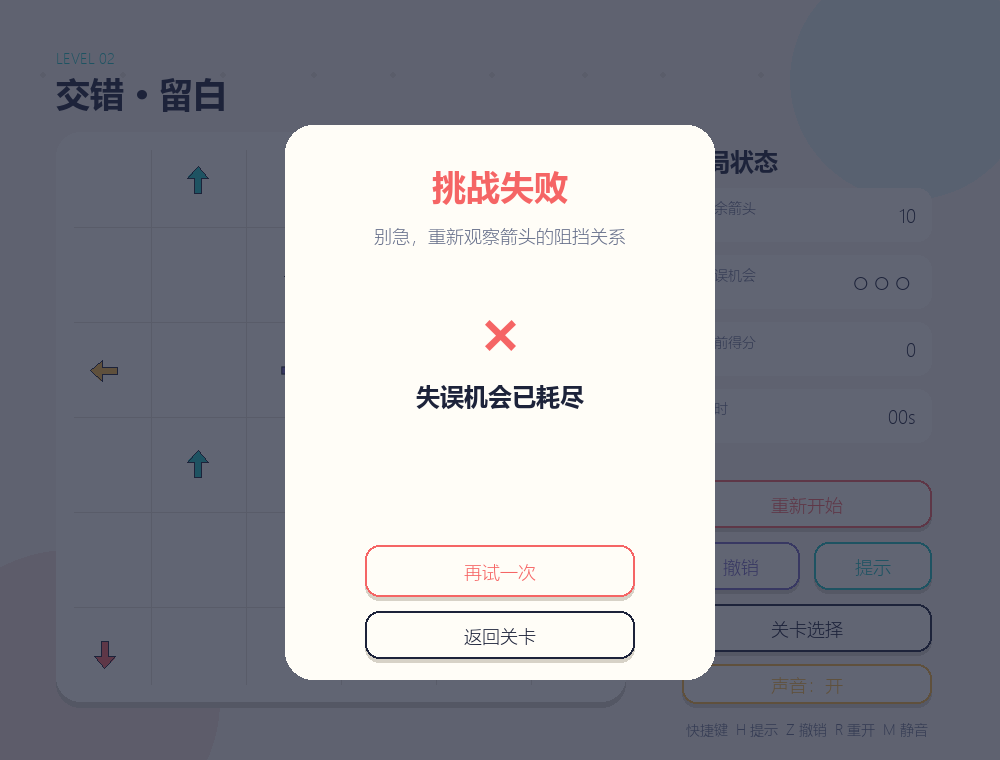

# 软件工程第二次个人作业：用 Python + AIGC 完成《一箭又一箭》

> 发布前请替换 3 处 `【待填写】`，并将本文中的截图上传到博客图床或使用 GitHub Raw 链接。

| 项目 | 内容 |
| --- | --- |
| 这个作业属于哪个课程 | [2026 秋软件工程与软件工程实践](https://edu.cnblogs.com/campus/fzu/2026-01SoftwareEngineeringandSoftwareEngineeringPractice/) |
| 这个作业要求在哪里 | 【待填写：本次作业网页链接】 |
| 这个作业的目标 | 使用 Python 和 AIGC 完成“一箭又一箭”小游戏 |
| 学号 | 【待填写：本人学号】 |
| GitHub 仓库 | [Luminance-l/OneArrowGame](https://github.com/Luminance-l/OneArrowGame) |

## 一、项目展示

游戏采用原创的米白纸张风格和四色矢量箭头，没有使用原商业游戏的代码或素材。

### 开始与关卡选择




### 游戏过程



### 通关与失败





## 二、项目介绍

棋盘中的每支箭只占一个格子，方向分为上、下、左、右。玩家点击箭头后，程序沿其朝向检查同一行或同一列：如果箭头和边界之间没有其他箭头，它会飞出棋盘；否则箭头会变红并晃动，界面显示 `BLOCKED`，同时失去一次机会。三次机会耗尽则失败，清空棋盘则进入下一关。

基础功能之外，我实现了五关、关卡选择、计时与得分、星级评价、提示、撤销、本地进度保存和 AI 自动求解。附加功能没有改变基础规则，主要目的是提升可玩性和可测试性。

## 三、实现思路

### 1. 数据结构

`Arrow` 是不可变数据类，保存 `row`、`col` 和 `Direction`。当前棋盘使用字典 `dict[(row, col), Arrow]`，因此判断某个格子是否被占用是 O(1)。`Direction` 枚举同时保存方向增量，例如 UP 为 `(-1, 0)`、RIGHT 为 `(0, 1)`。

关卡在 `level.py` 中以二维元组保存；加载关卡时转换成箭头字典。界面层只读取状态，不直接修改关卡数组。

### 2. 路径检测

核心算法从箭头前方一格开始，每次增加 `(dr, dc)`，直到遇到其他箭头或离开棋盘。这里特别注意不能从箭头自身开始，否则每支箭都会被自己阻挡。

```python
dr, dc = arrow.direction.delta
row, col = arrow.row + dr, arrow.col + dc
while 0 <= row < size and 0 <= col < size:
    blocker = arrows.get((row, col))
    if blocker is not None:
        return blocker
    row += dr
    col += dc
return None
```

时间复杂度为 O(n)，其中 n 是棋盘边长；空间复杂度为 O(1)。

### 3. 状态与动画分离

`GameState.click()` 只返回 `removed`、`blocked`、`empty` 或 `ignored`，便于测试。Pygame 收到 `removed` 后创建一个短生命期的 `FlyingArrow`，按方向移动并逐渐降低透明度；收到 `blocked` 后记录时间戳，在 650ms 内让箭头变红、左右晃动并显示提示。

这种分离使自动测试不必打开窗口，也避免动画帧率影响规则正确性。

### 4. AI 自动求解

求解器使用广度优先搜索。一个搜索状态是剩余箭头坐标的 `frozenset`；从该状态可以移除任意一支当前无遮挡的箭头。搜索到空集合时得到完整通关路径。提示功能只显示路径的第一步，而测试会要求所有关卡都能搜索到完整路径。

第 5 关初版就被求解器发现不可解，这比只依赖肉眼试玩更可靠。修改一支箭方向后，5 个关卡分别得到 6、10、15、17、24 步完整解。

## 四、AIGC 使用过程

我使用 OpenAI Codex 辅助需求拆解、编码、测试与文档整理，下面是最有代表性的四次协作。

| 子任务 | AIGC | AI 实现/提供 | 实际效果 | 人工判断与修改 |
| --- | --- | --- | --- | --- |
| 需求与结构 | Codex | 将 PDF 要求拆成规则、界面、测试、文档四层 | 核心逻辑可脱离 Pygame 测试 | 保留“基础优先”，删去复杂机关设想 |
| 路径检测 | Codex | 方向枚举与逐格扫描 | T01–T03、四方向测试通过 | 增加边缘朝外、首个阻挡物用例 |
| 关卡设计 | Codex | 5 个关卡与 BFS 求解器 | 首次发现第 5 关不可解 | 将 `(3,1)` 从 UP 改为 LEFT，复测得到 24 步解 |
| UI 与动画 | Codex | 矢量箭头、飞出淡出、碰撞晃动、截图模式 | 首次截图按钮出现方框字 | 删除不兼容字符，并修复结算计时继续增长 |

我体会到，AIGC 可以快速产出结构完整的初稿，但不会自动保证关卡可解，甚至测试代码本身也可能写错。只有真正运行、观察失败信息并设计回归测试，AI 输出才会变成可靠的软件。

## 五、测试结果

我将课程规定的 6 个测试全部写成自动化测试，并增加四方向、撤销、提示和全关卡可解性测试。

| 编号 | 测试内容 | 预期结果 | 实际结果 | 结论 |
| --- | --- | --- | --- | --- |
| T01 | 无阻挡箭头 | 飞出并消失 | 返回 `removed`，数量减 1 | 通过 |
| T02 | 有阻挡箭头 | 保留，机会减 1 | `(2,2)` 被 `(2,4)` 阻挡，3→2 | 通过 |
| T03 | 边缘朝外箭头 | 正常消失且不越界 | `(1,0)` 向左正常移除 | 通过 |
| T04 | 清空关卡 | 显示通关并进入下一关 | 状态 `CLEARED`，出现结算层 | 通过 |
| T05 | 机会耗尽 | 显示失败并可重开 | 状态 `FAILED`，出现“再试一次” | 通过 |
| T06 | 重新开始 | 布局和机会恢复 | 状态、箭头、机会均恢复 | 通过 |

执行命令：

```bash
python -m unittest discover -s tests -v
```

最终结果为 **10/10 通过**。此外还生成五张界面截图，逐张检查了字体、裁切、遮挡和按钮状态。

## 六、PSP 表格

| 任务 | 预估耗时（小时） | 实际耗时（小时） | 差异 |
| --- | ---: | ---: | ---: |
| 需求分析与游戏设计 | 0.8 | 0.5 | -0.3 |
| Python 与图形库学习 | 0.8 | 0.3 | -0.5 |
| 游戏界面实现 | 1.8 | 1.3 | -0.5 |
| 路径与碰撞逻辑实现 | 1.5 | 0.9 | -0.6 |
| 关卡设计 | 1.2 | 0.7 | -0.5 |
| AIGC 辅助开发 | 1.0 | 0.8 | -0.2 |
| 测试与修改 | 1.2 | 0.9 | -0.3 |
| README 与博客撰写 | 1.5 | 1.1 | -0.4 |
| **合计** | **9.8** | **6.5** | **-3.3** |

## 七、心得体会

这次作业让我感受最深的不是 Pygame 绘图，而是“看起来能玩”和“可以证明正确”之间的差别。路径扫描只有十几行，但方向、起点和边界任何一个细节都可能导致错误；关卡看起来很丰富，也可能形成互相阻挡的死环。

Codex 帮我快速搭好了结构、界面和测试初稿，但实际运行仍发现了不可解关卡、错误测试坐标、字体缺字和计时问题。解决这些问题时，我学会了把 UI 与规则拆开、用小测试定位错误、用求解器验证关卡，而不是反复手点碰运气。

如果继续完善，我会加入音量可调的原创音效、关卡编辑器和打包后的可执行文件。不过就本次作业而言，我更愿意保持规则清楚、依赖简单、测试充分，让别人按照 README 可以一次运行成功。

